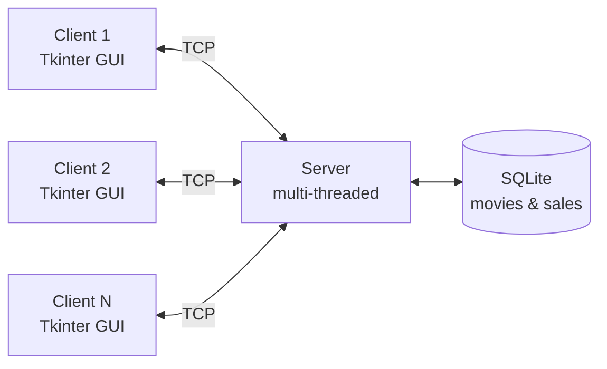

# 🎬 Cinema Ticketing System


A networked client-server cinema ticketing application built in Python. The server manages a SQLite database of movies and sales, while a Tkinter desktop client lets users browse movies and purchase tickets over TCP sockets.

---

## 📑 Table of Contents

- [Features](#-features)
- [Architecture](#-architecture)
- [Tech Stack](#-tech-stack)
- [Getting Started](#-getting-started)
- [Usage](#-usage)
- [Project Structure](#-project-structure)
- [Future Improvements](#-future-improvements)
- [Author](#-author)

---

## ✨ Features

- **Client-server architecture** – communication between client and server over TCP sockets
- **Concurrent connections** – a multi-threaded server handles multiple clients at the same time
- **Persistent storage** – movies and ticket sales are stored in a SQLite database
- **Desktop GUI** – a Tkinter client for browsing movies and buying tickets
- **Automatic receipts** – a receipt is generated whenever a ticket purchase is completed

---

## 🏗 Architecture



1. The **server** starts, opens the SQLite database, and listens for incoming TCP connections.
2. Each connecting **client** is handled in its own thread, so many users can be served at once.
3. Clients send requests (for example, list movies or purchase tickets); the server reads or updates the database and sends back a response.
4. On a successful purchase, a **receipt** is generated for the customer.

---

## 🛠 Tech Stack

| Component | Technology |
|-----------|------------|
| Language | Python |
| Database | SQLite3 |
| GUI | Tkinter |
| Networking | Socket programming (TCP) |
| Concurrency | Threading |

All dependencies are part of the Python standard library, so there is nothing extra to install.

---

## 🚀 Getting Started

### Prerequisites

- Python 3.8 or newer
- Tkinter (bundled with most Python installations)

> **Linux users:** if Tkinter is missing, install it with  
> `sudo apt install python3-tk`

### Installation

```bash
# Clone the repository
git clone https://github.com/<your-username>/<your-repo-name>.git

# Move into the project folder
cd <your-repo-name>
```

---

## ▶️ Usage

The server must be running before any client connects.

**1. Start the server**

```bash
python server.py
```

**2. Launch the client** (in a new terminal window)

```bash
python client.py
```

You can open several client windows at once to see the server handle multiple users concurrently.

**3. Buy a ticket**

1. Browse the list of available movies in the client window.
2. Select a movie and choose your ticket details.
3. Confirm the purchase to receive your receipt.

---

## 📁 Project Structure

```
.
├── server.py        # TCP server, request handling, and database logic
├── client.py        # Tkinter GUI client
└── README.md
```

> The SQLite database file is created and managed by the server.

---

## 🔮 Future Improvements

- User accounts and authentication
- Seat selection and real-time seat availability
- Admin interface for adding and removing movies
- Encrypted client-server communication (TLS)
- Sales reports and analytics

---

## 👤 Author

**Thabang Masebe**

---

## 📄 License

This project is open source. Add a `LICENSE` file (for example, [MIT](https://choosealicense.com/licenses/mit/)) to specify how others may use it.
